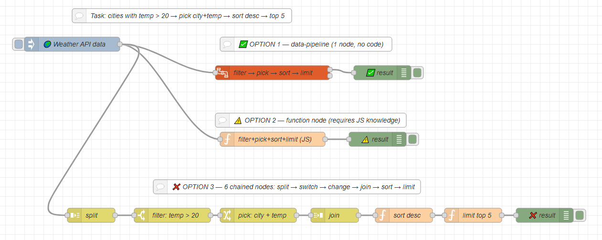

[](./LICENSE)

# nr-contrib-data-pipeline

A Node-RED node for transforming arrays using a visual pipeline of steps — no code required.

> **Note:** The structure and boilerplate of this project is based on [sai308/nr-contrib-humanize](https://github.com/sai308/nr-contrib-humanize), which served as a reference implementation for building custom Node-RED nodes.

## The Problem

Transforming data in Node-RED currently requires either:

**Option A — writing a function node:**
```javascript
msg.payload = msg.payload
  .filter(x => x.temp > 20)
  .map(x => ({ city: x.city, temp: x.temp }))
  .sort((a, b) => b.temp - a.temp)
  .slice(0, 5)
```
This breaks the no-code philosophy and requires JavaScript knowledge.

**Option B — chaining multiple nodes:**
```
split → switch → change → join → function → function
```
This clutters the canvas and is hard to read and maintain.

## The Solution

One node. Multiple steps. No code.

## Comparison



## Installation

```bash
cd ~/.node-red
npm i nr-contrib-data-pipeline
```

**Docker:**
```bash
docker exec -it <container> bash
npm install --prefix /data /data/nr-contrib-data-pipeline
exit
docker restart <container>
```

After restart the node appears in the palette under the **function** category — look for **data-pipeline**.

## Available Steps

| Step | Description | Params |
|---|---|---|
| **filter** | Keep only items matching a condition | `field`, `operator`, `value` |
| **map** | Transform a field using an expression (`value` = current field) | `field`, `expression`, `outputField` |
| **pick** | Keep only specified fields | `fields` (comma-separated) |
| **sort** | Sort by a field | `field`, `order` (asc/desc) |
| **limit** | Keep first N items | `count` |
| **flatten** | Flatten nested arrays | `field` (optional) |

Dot notation is supported for nested fields: `user.address.city`

## Filter Operators

`==` `!=` `>` `<` `>=` `<=` `contains` `exists`

## Outputs

| Output | Description |
|---|---|
| **1 — result** | Transformed array in `msg.payload` |
| **2 — error** | Original payload + `msg.error` with description |

## Example

**Input:**
```json
[
  { "city": "Kyiv",         "temp": 22, "humidity": 60 },
  { "city": "Lviv",         "temp": 17, "humidity": 72 },
  { "city": "Odesa",        "temp": 28, "humidity": 55 },
  { "city": "Zaporizhzhia", "temp": 26, "humidity": 48 },
  { "city": "Dnipro",       "temp": 24, "humidity": 50 }
]
```

**Pipeline:** `filter temp > 20` → `pick city, temp` → `sort temp desc` → `limit 5`

**Output:**
```json
[
  { "city": "Odesa",        "temp": 28 },
  { "city": "Zaporizhzhia", "temp": 26 },
  { "city": "Dnipro",       "temp": 24 },
  { "city": "Kyiv",         "temp": 22 }
]
```

## Demo Flow

A ready-to-use demo flow is available in [`demo-flow.json`](./demo-flow.json).

Import via: **☰ Menu → Import → select file**

The demo includes:
- **Comparison flow** — same result achieved 3 ways: pipeline vs function vs chained nodes
- **Test 1** — filter + sort + limit on weather data
- **Test 2** — map (price +20%) + pick on product list
- **Test 3** — flatten nested arrays (post tags)
- **Test 4** — error handling (non-array input)

## Project Structure

```
nr-contrib-data-pipeline/
├── data-pipeline/
│   ├── data-pipeline.js    ← node logic
│   └── data-pipeline.html  ← editor UI
├── demo-flow.json          ← importable demo
├── package.json
└── README.md
```
